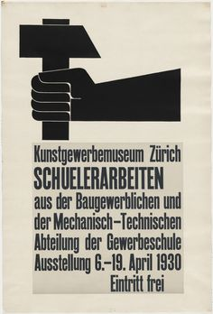

In deze poster gebruikt Ernst Keller, een Zwitserse ontwerper, het oog aan te trekken door dynamische activiteit te suggereren. "Het afdrukken van de afbeelding gebeurt door middel van letterpressen vanuit lino blokjes die overdrukt zijn van het type in ondoorzichtig grijs." De vingers die de hendel van de troffel grijpen, veranderen de hand in een vuist, een universeel symbool in politieke propaganda die de solidariteit van een menigte probeert te suggereren.

 

De interacties die ik heb verwezenlijkt zijn. Hovers klik en schuif animaties. De gebruiker kan door middel van deze interacties het beeld veranderen.

<b>SVG:</b> Het gegeven beeld met een schep of een hamer in de hand.

<b>Hovers:</b> Zodra de gebruiker met de muis over het beeld heen hovert transformeert het arm omhoog.

<b>Clicks:</b> De gebruiker kan kiezen tussen een schep en een hamer. Ook kan de grootte worden aangepast.

<b>Keys</b> spatiebar.

Ik wilde door middel van mijn website de gebruiker op speelse wijze de elementen kunnen veranderen naar hun eigen. De gebruiker kan zelf de grootte aanpassen en kiezen welk voorwerp ze willen gebruiken.

<b>Bronnen:</b>

https://css-tricks.com/snippets/css/keyframe-animation-syntax/
https://css-tricks.com/transforms-on-svg-elements/
https://www.w3schools.com/cssref/sel_hover.asp
https://www.w3schools.com/jsref/event_onclick.asp
https://www.w3schools.com/howto/tryit.asp?filename=tryhow_css_rangeslider
